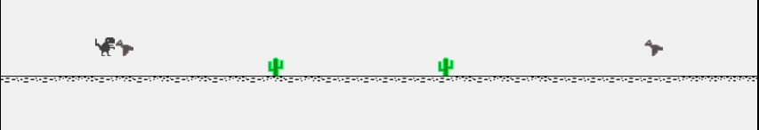

# Chrome Dino in Mips Assembly

This project was built as a final project for COMP 541 - Digital Logic. 

---

### Info

**Description** :  This game is a clone of the popular chrome dino game which requires the player to dodge the cactii and pterodactyls which are randomly generated and spawned. 

**Controls** : `Space` to jump. `R` to reset. 

**Features**: 
-   Used a memory mapped IO module to display the score (number of steps) on a board seg display. 
-   Plays a sound when you jump and also when game ends. 
-   Randomly generates obstacles using a prime number based psudo random number generator. 
-   Always generates valid obstacles [no impossible jumps]

### How to play: 

-  This game can be played by first downloading a mips cpu emulator from [here](https://github.com/jordanel/mips-emulator) and using the [set up Json file](ChromeDino_Simulator_Setup.json) to run the game. 

- This game can also be played on the Nexus DDR board. 

